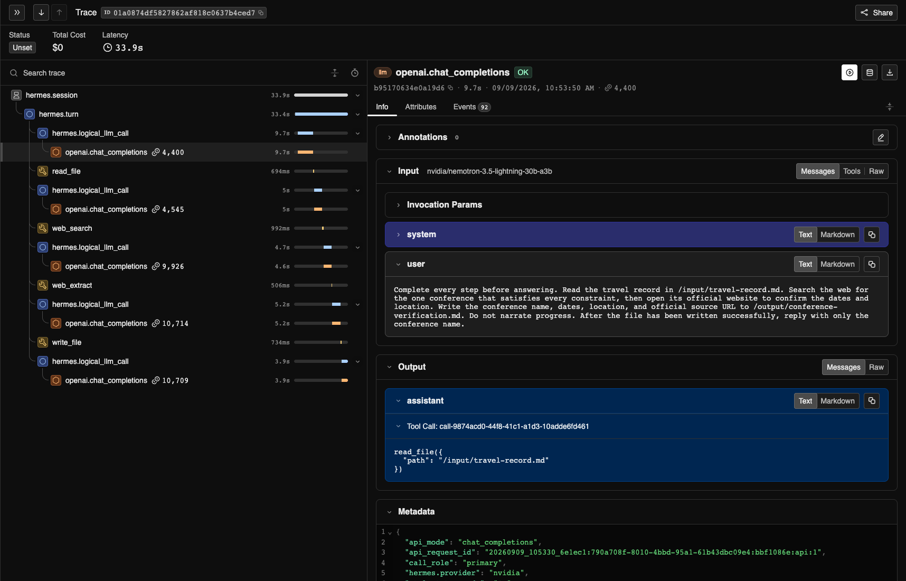
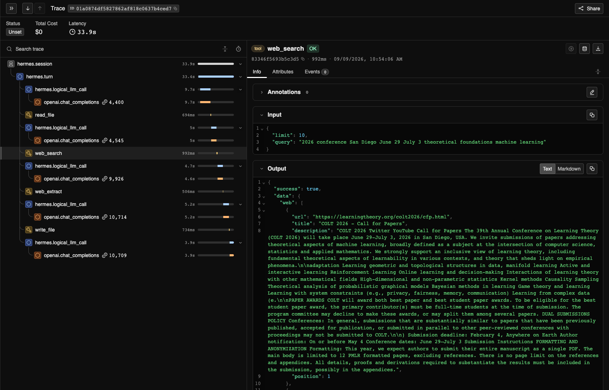
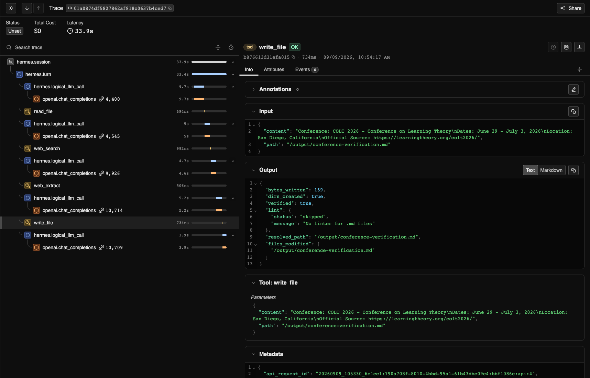

# Tracing Agent Harness Behavior with NVIDIA NeMo Relay

An agent can complete a coding task and still take an inefficient path. Repeated
searches, failed tool calls, and unnecessary retries are difficult to spot from
the final response alone, but they affect latency, token usage, and reliability.

This tutorial follows one deliberately simple Hermes Agent task with
[NVIDIA Nemotron 3.5 Lightning](https://build.nvidia.com/nvidia/nemotron-3.5-lightning-30b-a3b)
through NVIDIA Build. Hermes must use its terminal tool to run the included
[`sample.py`](sample-project/sample.py) script inside an isolated Docker
container and return the script's only output: `VALUE=42`. The fixed result
gives the tutorial an exact pass/fail check, so the walkthrough can focus on
how Hermes completed the task.

[NVIDIA NeMo Relay](https://docs.nvidia.com/nemo/relay/latest/getting-started/about)
is an open-source, multi-language agent runtime framework that provides a
shared execution model for scopes, managed tool and LLM calls, asynchronous
middleware, plugin lifecycles, adaptive caching, and lifecycle observability.

In this tutorial, Relay runs inside Hermes through Hermes' native integration.
It represents the session, turn, model, and terminal-tool lifecycles as ATOF
events and an ATIF trajectory. The tutorial does not configure Relay
middleware, guardrails, or gateway routing.

The Agent Trajectory Observability Format
([ATOF](https://docs.nvidia.com/nemo/relay/latest/reference/atof-event-format))
exporter writes the ordered lifecycle event stream, while the Agent Trajectory
Interchange Format
([ATIF](https://docs.nvidia.com/nemo/relay/configure-plugins/observability/atif))
exporter turns the same events into a step-based trajectory. Together, they
show both the detailed execution sequence and the agent's path to the verified
result.

**In this tutorial, you will:**

1. Set up an isolated Hermes Agent runtime with its native NeMo Relay
   integration.
2. Run a fixed terminal-tool task, verify the result, and inspect its ATOF
   event stream and ATIF trajectory.
3. Optionally run a file-and-web research task and inspect its model calls, tool
   calls, duration, token usage, and available cost estimates in
   [Arize Phoenix](https://arize.com/docs/phoenix).
4. Use trace evidence and a task verifier to evaluate a controlled agent
   change.

## Run the Tutorial

The setup script installs Hermes Agent `0.21.1` and the NeMo Relay `0.8.3`
dependency selected by the Hermes release lockfile. It creates the environment
under `.tutorial-runtime/` without changing your existing Hermes installation.

On macOS or Linux, install [Git](https://git-scm.com/downloads),
[curl](https://curl.se/download.html), and
[Docker](https://docs.docker.com/get-started/get-docker/). Start Docker and open
the
[Nemotron 3.5 Lightning model page](https://build.nvidia.com/nvidia/nemotron-3.5-lightning-30b-a3b)
on NVIDIA Build to generate an API key.

Run the following commands in order. The `keys.env` file is ignored by Git and
keeps the key out of your shell history.

```bash
# Clone the tutorial repository.
git clone https://github.com/mnajafian-nv/nemo-relay-hermes-examples.git

# Enter the cloned repository.
cd nemo-relay-hermes-examples

# Create the isolated Hermes Agent and NeMo Relay runtime.
./scripts/setup_tutorial_runtime.sh

# Copy the API-key template.
cp keys.env.example keys.env

# Add the NVIDIA Build key as NVIDIA_API_KEY in keys.env before continuing.

# Verify that Docker is running.
docker version

# Build the Docker image for the terminal-tool task.
./scripts/build_tutorial_image.sh

# Run the tutorial and export the ATOF event stream and ATIF trajectory.
./scripts/run_tutorial.sh
```

**Success check:** Confirm that the output includes all of the following:

- `Task verified: VALUE=42`
- An ATOF summary with at least one completed LLM scope, positive token usage,
  and one tool call
- An ATIF summary with the agent, model, and trajectory step count
- `tool errors: 0`
- An `Artifacts:` path under `artifacts/runs/`

### Why the Tutorial Uses Docker

Hermes can execute terminal commands, so this tutorial runs them in an isolated
Docker container instead of on your host. The container cannot access the
network, repository checkout, or NVIDIA API key.

## Review the Run

The final output prints an `Artifacts:` path. That run directory contains:

- `atof/run.jsonl`, the raw, ordered lifecycle event stream.
- `atif/trajectory-*.json`, the run organized into agent steps, tool calls, and
  observations.

For a compact comparison of the two formats, review the minimal
[example ATOF trace](examples/terminal-task.atof.jsonl),
[example ATIF trajectory](examples/terminal-task.atif.json), and
[example walkthrough](examples/README.md).

### Inspect a Saved Run

To summarize and validate token usage for a saved run, replace
`<run-directory>` with the path printed by the tutorial:

```bash
HERMES_PYTHON=".tutorial-runtime/venv/bin/python"
"$HERMES_PYTHON" scripts/summarize_atof.py \
  <run-directory>/atof/run.jsonl \
  --require-token-usage
"$HERMES_PYTHON" scripts/summarize_atif.py \
  <run-directory>/atif/trajectory-*.json
```

Treat the trace as diagnostic evidence, not the evaluator. Use the task's
exact success check to determine whether it succeeded.

> [!CAUTION]
> Review traces before sharing them. They can contain prompts, tool arguments
> and results, file paths, model output, and other application data.

## Inspect a Multi-Tool Hermes Trace in Phoenix

The first exercise isolates one terminal-tool task. This follow-up shows a more
realistic agent path across files and the web. Hermes reads a fixed
[conference travel record](conference-task/travel-record.md), identifies the
event that matches every constraint, verifies it on the official conference
website, and saves a verification report.

Relay exports an ATOF event stream, an ATIF trajectory, and an
[OpenInference trace](https://docs.nvidia.com/nemo/relay/latest/configure-plugins/observability/openinference)
for the local Phoenix instance. If you completed the first exercise, your
environment is ready. Otherwise, follow the setup steps through
`./scripts/build_tutorial_image.sh`. You do not need to run
`./scripts/run_tutorial.sh` before starting this exercise.

By default, this exercise reuses the Nemotron model and `NVIDIA_API_KEY` from
the first exercise. No additional model configuration or credential is needed.

No separate Phoenix installation is required. The exercise downloads the
pinned Phoenix container image if needed and starts it locally. For background
on this deployment model, see the
[Phoenix Docker guide](https://arize.com/docs/phoenix/self-hosting/deployment-options/docker).
If port `6006` is already in use, use the alternate-port command below. The
script does not stop or replace the existing service.

### Run the Research Task with Nemotron

Run the research task with the same Nemotron model and NVIDIA Build key used by
the first exercise:

```bash
./scripts/run_conference_research_with_phoenix.sh
```

Hermes uses its built-in keyless web search, so no Tavily key or other search
credential is required. The runner verifies all of the following:

- The final answer identifies the expected conference.
- The saved verification report contains the dates, location, and official
  source.
- The ATOF trace contains successful `read_file`, `web_search`, `web_extract`,
  and `write_file` calls.
- ATIF contains the trajectory.
- Phoenix receives the corresponding model and tool spans with positive token
  usage.

The script prints a Phoenix URL and saves the response, verification report,
ATOF events, and ATIF trajectory under
`artifacts/conference-research/nemotron/`. The fixed input is mounted
read-only, a separate output directory is mounted read/write, writes are
restricted to `/output`, and your API key is not passed to the tool container.

Open the printed Phoenix URL, select the project named in the verification
output, and expand its trace. Follow the `read_file`, `web_search`,
`web_extract`, and `write_file` spans to see how Hermes moved from the travel
record to the saved report. Compare that view with the ATOF and ATIF summaries
printed by the runner.

### Verified Nemotron Run

A clean run of this tutorial completed the research task with Hermes Agent
`0.21.1`, NeMo Relay `0.8.3`, and Nemotron 3.5 Lightning. The
[sanitized result summary](results/conference-research-nemotron-3.5-lightning.json)
records the exact runtime, endpoint, API mode, verifier result, and execution
measurements. Phoenix received five model calls, four tool calls, no tool
errors, and 40,294 tokens over 33.9 seconds. No Nemotron price was configured,
so this run does not claim an estimated cost.

Select the first model span to inspect the user's research request and the
first tool call Hermes chose.

[](screenshots/phoenix-nemotron-user-query.png)

Select the `web_search` span to inspect the query and the sources returned to
Hermes.

[](screenshots/phoenix-nemotron-web-search-span.png)

Select the `write_file` span to verify the report content, destination, and
successful write result.

[](screenshots/phoenix-nemotron-write-file-span.png)

Select the final model span to connect the verified response to that call's
duration and token usage.

[](screenshots/phoenix-nemotron-final-llm-span.png)

### Inspect Another Model

To inspect another model without changing the task or verifier, copy the model
profile template:

```bash
cp config/model_profile.env.example model-profile.env
```

Update `model-profile.env` with the model, endpoint, API mode, and credential
variable supplied by your provider. Add the matching credential to `keys.env`,
then run:

```bash
./scripts/run_conference_research_with_phoenix.sh \
  --model-profile model-profile.env
```

The runner supports the `chat_completions`, `anthropic_messages`, and
`codex_responses` API modes provided by Hermes. The selected endpoint must
support tool use. Both runs use the same task, tools, execution limits, and
verifier, but live web-search results can differ. Use this exercise to inspect
execution paths, not to attribute a difference to the model. A controlled model
comparison also requires fixed search evidence and repeated runs.

### Optional Provider Example: Claude Sonnet 5

The retained screenshots show the same task run with Claude Sonnet 5 through a
separately configured compatible endpoint. The
[sanitized result summary](results/conference-research-claude-sonnet-5.json)
records the runtime, capture time, verifier result, and measurements reported
by Phoenix: five model calls, five tool calls, no tool errors, 60,059 tokens,
and an estimated total cost of `$0.053960`. This retained result uses Hermes
Agent `0.20.5` and NeMo Relay `0.7.2`. It illustrates a second provider-shaped
trace and is not a performance comparison with the Nemotron run. Cost
estimates depend on whether the selected model has pricing metadata available
to the telemetry backend.

The trace tree shows the total estimated cost above the span list and token
counts beside the model spans. Select the image to open it at full resolution.

[](screenshots/phoenix-trace-tree.png)

The following full-resolution views retain the tool and final-response details
from this optional provider run:

- [Inspect the Sonnet web-search query and results](screenshots/phoenix-web-search-span.png).
- [Inspect the Sonnet final response and model-call metrics](screenshots/phoenix-final-llm-span.png).

Phoenix uses port `6006` by default. If that port is unavailable, choose another
local port:

```bash
PHOENIX_UI_PORT=6007 ./scripts/run_conference_research_with_phoenix.sh
```

Phoenix data remains in the tutorial container until you remove it:

```bash
# Stop Phoenix and delete the tutorial container and its local trace data.
./scripts/stop_phoenix.sh
```

If you selected another port, pass the same value when removing the container,
for example `PHOENIX_UI_PORT=6007 ./scripts/stop_phoenix.sh`.

The keyless search providers are public services and can be rate-limited. The
runner fails if Hermes does not complete a real `web_search`; it does not accept
an answer based only on model knowledge.

## Apply This Approach to Your Agent

1. Define a fixed task with an exact success check.
2. Run it several times with the model, prompt, tools, and execution limits held
   constant.
3. Use the Relay traces to identify one repeated failure or inefficiency.
4. Make one focused change to the responsible prompt, tool configuration, or
   harness behavior.
5. Run the same task again under the same conditions.
6. Compare task completion first, then use model calls, tool calls, errors, and
   elapsed time to explain the result.

## Troubleshooting

### Main Tutorial Authentication Fails

Confirm that `keys.env` contains a valid `NVIDIA_API_KEY` with access to the
Nemotron model configured in [config/smoke.env](config/smoke.env).

### Optional Phoenix Exercise Authentication Fails

The default run uses `NVIDIA_API_KEY`. A comparison run uses the credential
variable named by `MODEL_PROFILE_API_KEY_ENV` in `model-profile.env`. Confirm
that `keys.env` contains the expected variable and that the key can access the
configured model and endpoint.

### Tutorial Image Is Unavailable

Run `./scripts/build_tutorial_image.sh`, then rerun the tutorial.

### Hermes Reaches the Turn Limit

Inspect the ATOF stream to determine whether the model, tool, or task prompt
caused the extra work.

## License

This repository is licensed under the [Apache License 2.0](LICENSE).
