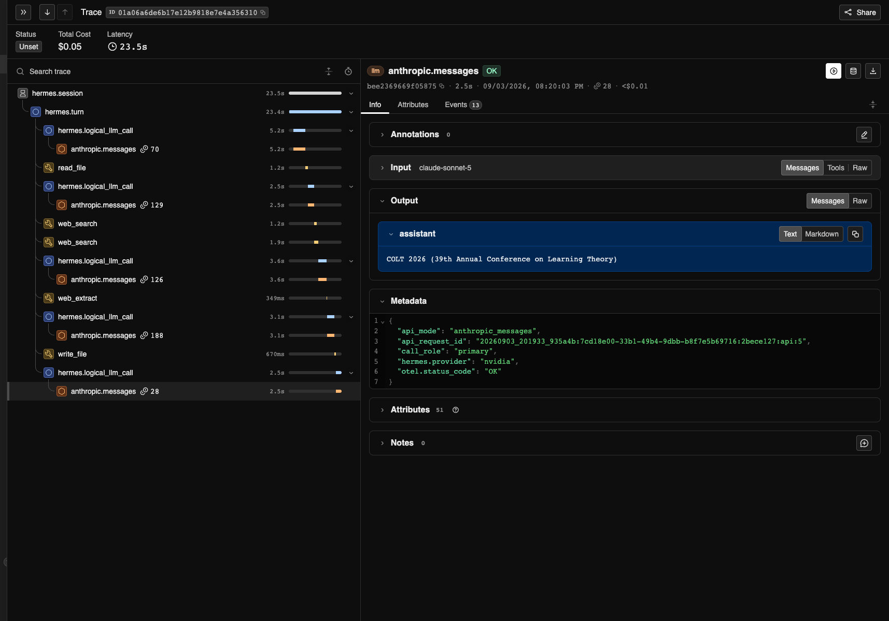

# Trace Hermes Agent Runs with NeMo Relay

In this guide, you will examine an agent run in three ways: the raw ATOF event
stream, an ATIF trajectory, and an OpenInference-compatible trace in Phoenix.

## Understand the Trace Outputs

- [ATOF](https://docs.nvidia.com/nemo/relay/latest/reference/atof-event-format)
  is NeMo Relay's canonical event format for scope lifecycle events and marks.
  Relay's ATOF exporter writes the raw, ordered event stream to JSONL.
- [ATIF](https://github.com/harbor-framework/harbor/blob/main/rfcs/0001-trajectory-format.md)
  is an external, JSON-based format for agent trajectories. [Relay's ATIF
  exporter](https://docs.nvidia.com/nemo/relay/latest/configure-plugins/observability/atif)
  converts the events associated with a run into ATIF steps, tool calls, and
  observations.
- [OpenInference](https://github.com/Arize-ai/openinference/blob/main/spec/README.md)
  defines semantic conventions for tracing AI applications with OpenTelemetry.
  [Relay's OpenInference
  projection](https://docs.nvidia.com/nemo/relay/latest/configure-plugins/observability/openinference)
  applies those conventions when it exports OpenTelemetry trace data.

See the
[NeMo Relay observability guide](https://docs.nvidia.com/nemo/relay/latest/configure-plugins/observability/about)
for other exporters and configuration options.

> [!CAUTION]
> Traces can include prompts, model responses, tool inputs and outputs, and file
> paths. Review them before sharing.

## Inspect the Terminal Task Traces

Complete the [Quick Start](README.md#quick-start) before continuing. It runs the
fixed terminal task and creates the ATOF and ATIF files used in this section.

After the task finishes, the runner prints an `Artifacts:` path. That run
directory contains:

- `atof/run.jsonl`, the raw, ordered lifecycle event stream.
- `atif/trajectory-*.json`, the run organized into agent steps, tool calls, and
  observations.

The repository also includes a minimal
[ATOF example](examples/terminal-task.atof.jsonl) and matching
[ATIF example](examples/terminal-task.atif.json). The
[example walkthrough](examples/README.md) shows how the ATOF model and tool
events map to ATIF trajectory steps.

### Inspect a Saved Run

To summarize and validate token usage for a saved run, set `RUN_DIRECTORY` to
the path printed by the tutorial:

```bash
HERMES_PYTHON=".tutorial-runtime/venv/bin/python"
RUN_DIRECTORY="artifacts/runs/<timestamp-pid>"
"$HERMES_PYTHON" scripts/summarize_atof.py \
  "$RUN_DIRECTORY/atof/run.jsonl" \
  --require-token-usage
"$HERMES_PYTHON" scripts/summarize_atif.py \
  "$RUN_DIRECTORY"/atif/trajectory-*.json
```

The `Task verified: VALUE=42` line confirms the result. The two summaries show
the model calls, tool calls, token usage, and trajectory steps for the run.

## Trace a Conference Research Task in Phoenix

The Quick Start traced one terminal call. This exercise follows a longer Hermes
run that combines file access with web research.

The input is a [travel record](conference-task/travel-record.md) for an unnamed
conference in San Diego. It says that the traveler attended from June 29
through July 3, 2026, and that the event focused on the theoretical foundations
of machine learning. Hermes must:

1. Read the travel record.
2. Search for the conference that matches every constraint.
3. Confirm the dates and location on the official conference website.
4. Save the conference name, dates, location, and source URL to a report.
5. Return only the conference name.

During the run, Relay writes the ATOF event stream and ATIF trajectory to the
run directory. Relay also sends OpenInference-compatible trace data to Phoenix
over OTLP. Phoenix displays that trace data; it does not import the saved ATOF
or ATIF files.

### Prepare the Research Exercise

If you completed the first exercise, your environment is ready. Otherwise,
complete the setup steps through `./scripts/build_tutorial_image.sh`. You do
not need to run `./scripts/run_tutorial.sh` first.

By default, this exercise reuses the Nemotron model and `NVIDIA_API_KEY` from
the first exercise. No additional model configuration or credential is needed.

You do not need to install Phoenix separately. The script pulls the pinned
Phoenix image and starts a local container. The
[Phoenix Docker guide](https://arize.com/docs/phoenix/self-hosting/deployment-options/docker)
explains this deployment option.

### Run the Research Task

Run the research task:

```bash
./scripts/run_conference_research_with_phoenix.sh
```

Phoenix uses port `6006` by default. If that port is already in use, run the
exercise on another local port. The script does not stop or replace the
existing service.

```bash
PHOENIX_UI_PORT=6007 ./scripts/run_conference_research_with_phoenix.sh
```

Hermes uses its built-in keyless web search, so no Tavily key or other search
credential is required. Because the search service is public, the task can fail
if the service rate-limits the request.

### Check the Result

The runner checks both the task result and the observability output:

- The final answer is `COLT 2026`.
- The saved report identifies `COLT 2026`, June 29 through July 3, 2026, San
  Diego, and an official `learningtheory.org` source.
- The ATOF event stream contains successful `read_file`, `web_search`,
  `web_extract`, and `write_file` calls.
- The runner creates a nonempty ATIF trajectory.
- Phoenix receives the model and tool spans and reports a positive token total
  for the run.

When verification passes, the script prints the Phoenix link and the run
directory. The run directory is under
`artifacts/conference-research/nemotron/` and contains the response,
verification report, ATOF events, and ATIF trajectory. The file tools can read
the task input and write only to a separate output directory. The Docker
container never receives your API key.

### Verified Nemotron Run

A clean run completed the research task with Hermes Agent `0.21.1`, NeMo Relay
`0.8.3`, and Nemotron 3.5 Lightning. The
[result summary](results/conference-research-nemotron-3.5-lightning.json)
records the configuration and verifier result. Phoenix received five model
calls, four tool calls, no tool errors, and 40,294 tokens over 33.9 seconds. It
did not calculate a cost because no pricing information was available for the
model.

### Explore the Agent Run in Phoenix

After the run, open [Phoenix](http://localhost:6006/projects) in your browser.
If you used a different port, update the URL to match. The trace tree appears
on the left, and selecting a model or tool call opens its details on the right.

Start with the first and final model calls. The first call shows the request to
read the travel record, find the matching conference, verify it on an official
website, and save a report. In a successful run, the final call returns
`COLT 2026`.

Expand the trace tree and select the calls between the first and final model
calls in order. A model call shows the request Hermes sent, the model's
response, and any tool calls requested by the model. A tool call shows the
arguments generated by the model and the result returned by the tool. For a
failed run, open the last successful call and inspect the next call or error.

Compare the token counts and durations shown beside the model calls. If one
call stands out, open it and check its request for repeated context. Then check
the preceding and following tool calls for repeated work or errors. A large or
slow call deserves investigation, but it is not automatically inefficient.
Phoenix also shows estimated cost when it has pricing information for the
model.

Select the first model call to inspect the research request and the
`read_file` request generated by the model.

[](screenshots/phoenix-nemotron-user-query.png)

Select the `web_search` span to inspect the query and the sources returned to
Hermes.

[](screenshots/phoenix-nemotron-web-search-span.png)

Select the `write_file` span to verify the report content, destination, and
successful write result.

[](screenshots/phoenix-nemotron-write-file-span.png)

Select the final model call to inspect the response, duration, and token usage.

[](screenshots/phoenix-nemotron-final-llm-span.png)

### Trace the Same Task with Another Model

To inspect another model without changing the task or verifier, copy the model
profile template:

```bash
cp config/model_profile.env.example model-profile.env
```

Update `model-profile.env` with the model, endpoint, API mode, and the name of
the environment variable that holds your provider API key. Add that variable
and its value to `keys.env`, then run:

```bash
./scripts/run_conference_research_with_phoenix.sh \
  --model-profile model-profile.env
```

The runner supports the `chat_completions`, `anthropic_messages`, and
`codex_responses` API modes provided by Hermes. The selected endpoint must
support tool use. These live-search runs are useful for exploring agent
behavior, not ranking models. For a controlled comparison, follow
[Evaluate a Harness Change](#evaluate-a-harness-change).

#### Claude Sonnet 5 Example

These screenshots show the same conference research task with Claude Sonnet 5.
The task and verifier remain unchanged; only the model configuration changes.
Use the traces to compare the sequence of model and tool calls, token usage,
duration, errors, and any cost reported by Phoenix. You can configure your own
compatible model endpoint to repeat the exercise. The
[result summary](results/conference-research-claude-sonnet-5.json) records the
configuration and verifier result. Phoenix reported five model calls, five tool
calls, no tool errors, 60,059 tokens, and an estimated cost of `$0.053960`.

The trace tree shows the total estimated cost above the span list and token
counts beside the model spans. Select the image to open it at full resolution.

[](screenshots/phoenix-trace-tree.png)

| Web-Search Call | Final Model Call |
|---|---|
| [](screenshots/phoenix-web-search-span.png) | [](screenshots/phoenix-final-llm-span.png) |

## Evaluate a Harness Change

Use the following process to evaluate a change:

1. Choose one change, such as different prompt text, a tool description, or a
   retry policy, and decide how many times to run each configuration.
2. Run the current configuration to establish the baseline.
3. Apply only the chosen change and repeat the task the same number of times.
4. Keep the model version, endpoint, input files, available tools, turn limit,
   and run budget unchanged. Use the same seed and sampling settings when the
   model provider and agent harness support them.
5. Compare task success first. Then compare model calls, tool calls, errors,
   token usage, total duration, and estimated cost if Phoenix reports one.

The research exercise queries the live web, so its results can change between
runs. Before using it for an A/B test, replace live search with a fixed fixture
that returns the same responses in both configurations.

## Stop Phoenix

When you finish, stop Phoenix and remove the tutorial container and its local
trace data:

```bash
./scripts/stop_phoenix.sh
```

If you ran Phoenix on another port, set that port again when you stop it:

```bash
PHOENIX_UI_PORT=6007 ./scripts/stop_phoenix.sh
```

## Troubleshooting

### NVIDIA API Authentication Fails

Confirm that `keys.env` contains a valid `NVIDIA_API_KEY` with access to the
Nemotron model configured in [config/smoke.env](config/smoke.env).

### Another Model Cannot Authenticate

The default run uses `NVIDIA_API_KEY`. A comparison run uses the credential
variable named by `MODEL_PROFILE_API_KEY_ENV` in `model-profile.env`. Confirm
that `keys.env` defines that variable and that its value can access the model
and endpoint in `model-profile.env`.

### Tutorial Image Is Unavailable

Run `./scripts/build_tutorial_image.sh`, then rerun the tutorial.

### Hermes Reaches the Turn Limit

Inspect the saved ATOF event stream for repeated model calls, tool calls, or
errors. If the run appears in Phoenix, open the final completed call and inspect
the next span or error.
